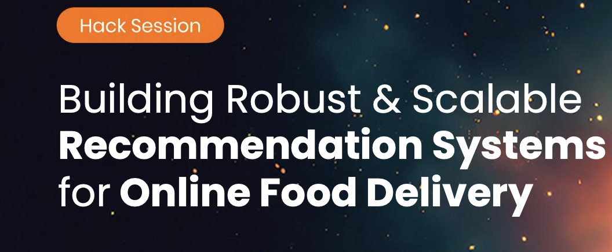

# Building Robust and Scalable Recommendation Systems for Online Food Delivery
> Data Hack Summit 2023

## Agenda
- Why Recommend?
    + Popular Use-Cases
    + Top Challenges
- How to Recommend
    + Key Concepts & Steps
    + Different Approaches
- Evaluate and Optimize Recommendations
    + Key Metrics
    + A/B Tests & Beyond
- Robustness & Scalability
    + Addressing Scale & Robustness
- Let Us Recommend
